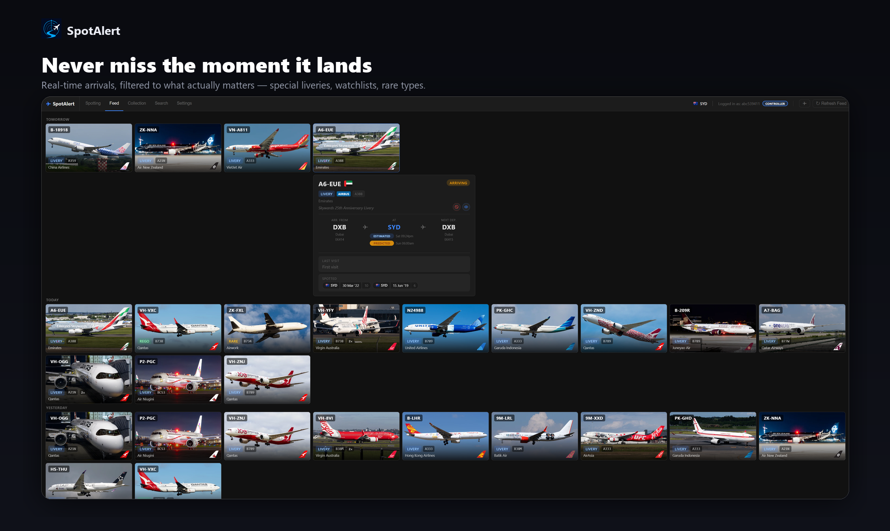
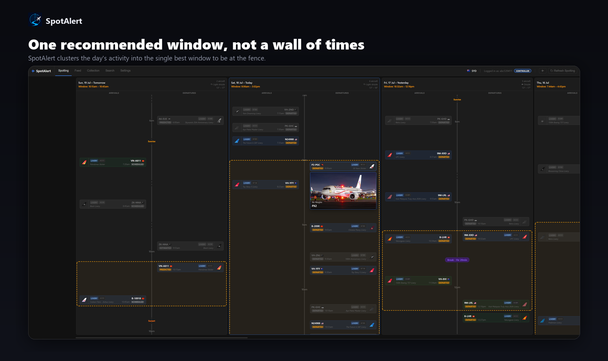
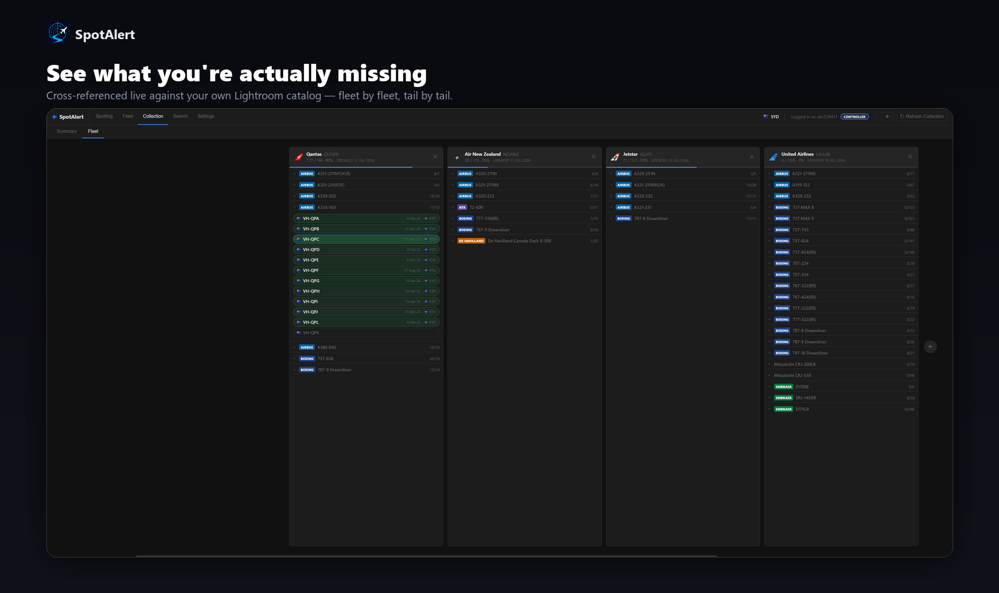
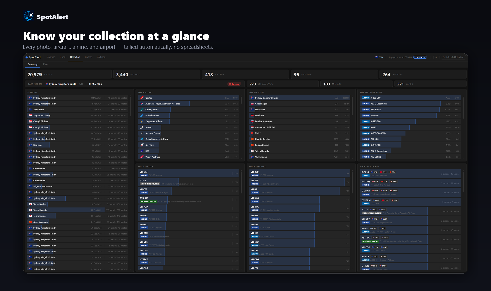
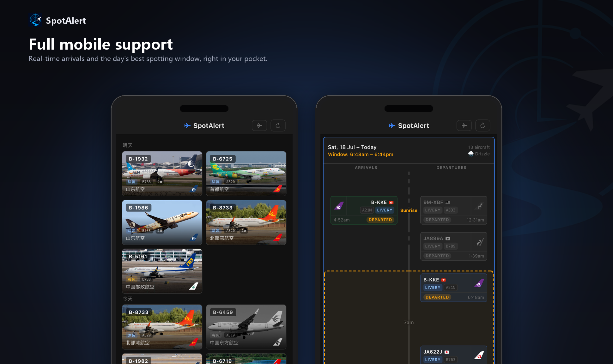

<p align="center">
  
</p>

<h1 align="center">SpotAlert</h1>

<p align="center"><b>English</b> | <a href="README.zh.md">简体中文</a></p>

A self-hosted aircraft-spotting assistant. It watches live arrivals at one or more airports and tells you the moment something worth grabbing a camera for shows up — a special livery, a plane on your watchlist, a rare airline/type combo, or military traffic on approach. A multi-user Progressive Web App (PWA) gives everyone in the spotting group their own login, their own filters, and a push notification straight to their phone, in either English or Chinese.

<p align="center">
  
</p>
<p align="center">
  
</p>
<p align="center">
  
</p>
<p align="center">
  
</p>
<p align="center">
  
</p>

---

## What it actually does, day to day

You (the **Controller**) pick an airport and tell SpotAlert what you care about — keywords that show up in special-livery airline names, specific registrations or airlines you're tracking, or just "tell me if this type hasn't shown up in two weeks." SpotAlert keeps polling live arrivals in the background, and the moment something matches:

- A card appears on the **Feed** immediately, with the aircraft's photo, route, live status, and predicted departure time.
- A **push notification** goes out to every phone that's opted in — in whatever language that user has set.
- It's folded into that day's **Spotting** recommendation — SpotAlert clusters the day's interesting arrivals into a single best window to head out, factoring in lighting quality and weather.

If you shoot and keep a Lightroom catalog, SpotAlert cross-references it (read-only) so **Collection** and **Fleet** know what you've *already* photographed, not just what's flying — and you can tap straight through to the actual photo from any past session, right inside the app.

It's built for more than one person from the ground up: invite a **Pilot** (their own filters and watchlists, scoped to whichever airports you grant) or a **Passenger** (read-only, follows your filters) — everyone gets their own login, their own push notifications, their own language.

---

## Features

### Arrival Filters

Each filter triggers independently — a single flight can match more than one:

1. **Special Livery** — matches configurable keywords in the airline name and extracts the livery description (e.g. "Air New Zealand (All Blacks Livery)" → "All Blacks Livery"); shows the original Chinese text when the source data provides it bilingually
2. **Rego Watchlist** — a specific registration you're tracking
3. **Type Watchlist** — a specific airline + aircraft type combination
4. **Airline/Operator Watchlist** — any aircraft from a watched airline or operator
5. **Rare Plane** — an airline + aircraft type combination reappearing after being absent for a configurable number of days

### Web App (PWA)

Installable as a home-screen app on iOS/Android, accessible from any browser on your network. Fully bilingual (English/Chinese), set per user.

- **Feed** — day-grouped cards for every match; route, live status, departure prediction, aircraft photo, and (if you've shot it before) your own history with that tail
- **Spotting** — the day's recommended window, clustered by activity gaps, with lighting quality and weather
- **Collection** — cross-references your Lightroom catalog against the feed; shows what's photographed, what's missing, and per-keyword session stats
- **Fleet** — live full-fleet data per airline; pills show which tails you've captured and let you add unseen ones straight to your watchlist
- **Search** — look up a registration's sighting history, browse route equipment by flight number, or browse your whole catalog
- **Session photo preview** — tap any past session anywhere in the app to see the actual photo you took — Controller-only, read-only access to your photo library (see below)
- **Settings** — every filter, watchlist, and monitoring setting lives here, gated by role

### Multi-User, Multi-Airport

- **Roles**: Controller (full control), Pilot (own filters/watchlists, scoped to granted airports), Passenger (read-only, follows the Controller's filters)
- A single deployment can **monitor multiple airports** at once — each with its own monitoring, filters, and data
- **Push notifications** (Web Push/VAPID — no third-party service, no Telegram) are fanned out per subscriber, each in their own language, re-checked against their own filters and preferences

### Military Traffic

- Monitors nearby military aircraft via the [adsb.fi](https://opendata.adsb.fi) open data API — no API key required
- Detects aircraft on approach within a configurable radius/altitude and tracks that sighting live (GPS trail) until it leaves or lands
- Notification includes country of origin (from the ICAO hex address), registration, callsign, aircraft type, and distance

### Session Photo Preview

Tap any past spotting session anywhere in the app to see the actual photo, overlaid with that flight's airline/type/livery info — the same treatment as the Feed's own photo cards. Reads the preview embedded directly in your RAW files (no extra export step), and never modifies the originals — the mount is read-only at the Docker level, and the app itself never writes to it. Setup is covered below under [Lightroom / Photo Integration](#lightroom--photo-integration).

### Spot Recommendation

Clusters the day's interesting arrivals into a single best window instead of a flat list of times.

- **Activity clustering** — a gap larger than your configured threshold starts a new window; the largest cluster is taken, then tightened to the smallest span that still covers every flight in it
- **Lighting quality** — flags low/fading light around sunrise/sunset and harsh overhead light around midday
- **Departure pairing** — every arrival is matched to its outbound departure (live board → history → a learned turnaround pattern), so you know how long the aircraft will actually be on the ground
- **Weather** — shown alongside each day's window; also feeds an optional spotting-alert push

### Lightroom Catalog Integration

Reads your Adobe Lightroom catalog (read-only, the main app never writes to it) to enrich Feed/Collection/Fleet with your own shooting history. Aircraft metadata (registration, airline, type, airport) needs to be tagged in Lightroom, either via the [AircraftMetadata Lightroom Plugin](https://github.com/aviationphoto/AircraftMetadata-Lightroom-Plugin) or **SpotAlert Studio** (below) — both write to the catalog using the same plugin ID, so SpotAlert can't tell them apart.

### SpotAlert Studio (companion app)

A separate, local-only companion app (`studio/`) that organizes your RAW photo inbox — looks up each file's registration against public flight data (falling back to JetPhotos for military aircraft), files it into a `{date} - {airport}/{airline}/{registration}/` folder structure, and writes the resolved metadata directly into your Lightroom catalog. It's the one part of this project that writes to your catalog. It needs direct filesystem access, so it runs natively on your own machine, not in Docker.

```powershell
.\studio.ps1
```

See [studio/README.md](studio/README.md) for setup.

---

## Requirements

- Docker + Docker Compose (recommended — this is how the project itself is deployed and tested)
- Or, to run the two processes directly without Docker: Python 3.12+

---

## Quick Start (Docker Compose)

1. **Clone the repo**
   ```bash
   git clone https://github.com/abc539411/spotalert.git
   cd spotalert
   ```

2. **Edit `docker-compose.yml`** — the paths on the left of each volume mount are *this project's own* deployment host paths (a Synology NAS). Change them to wherever you actually want each piece of data to live on your host:
   ```yaml
   volumes:
     - <your-path>/data:/app/data
     - <your-path>/lightroom:/app/lightroom
     - <your-path>/logs:/app/logs
     - <your-path>/translations:/app/static/translations
     - <your-path>/airline_logos:/app/static/airline_logos
     - <your-path>/session_thumbs:/app/static/session_thumbs
     # optional — only if you want the session photo preview feature (see below):
     - "<your-photos-folder>:/app/photos:ro"
   ```

3. **Build and start**
   ```bash
   docker compose up -d --build
   ```

4. **Find your admin password** — a fresh install auto-creates a Controller account on first startup:
   ```bash
   docker logs spotalert | grep "initial Controller"
   ```
   Visit `http://<your-host>:7478`, log in as `admin` with that password, then change it from the Settings tab.

5. **Add your first airport** — Settings → Airports → Add Airport (IATA code). Monitoring starts immediately.

6. **(Optional) Lightroom integration** — upload your `.lrcat` file under Settings → Collection → My Catalog, or point `LR_CATALOG_PATH` at a file already inside the `lightroom/` volume.

That's the whole setup — the app is already polling arrivals, and matches will start showing up once you configure filters (Settings → the relevant filter card).

### Without Docker

Run the two processes directly:

```bash
pip install -r requirements.txt
python main.py              # web server, also launches/supervises the monitor process
```

`main.py` starts `monitor_service.py` itself — you don't need to run it separately unless you want the monitor loop running with no web UI at all, in which case `python monitor_service.py` also runs standalone.

---

## Lightroom / Photo Integration

Two independent, optional features:

- **Read-only catalog access** (Collection/Fleet/Search-Catalogue data, the "already shot" filter threshold): upload a `.lrcat` per user in Settings, or mount it via the `lightroom/` volume.
- **Session photo preview** (tap a session to see the actual photo): mount your RAW photo folder into the container read-only (see the optional volume line in Quick Start above), and tell it the in-container path under Settings → Collection → Session Photos Path (defaults to `/app/photos` — only change this if you mounted somewhere else). Needs `exiftool` in the image, which the provided `Dockerfile` already includes. Controller-only.

---

## Configuration

Once you're logged in, almost everything is configured from the **Settings** tab, not environment variables or config files. A few of the more important ones:

| Setting | Description | Default |
|---|---|---|
| `CHECK_INTERVAL_MINUTES` | How often to poll for arrivals | 30 |
| `FETCH_PAGES` | Pages to fetch per check (~100 flights/page) | 2 |
| `SPECIAL_LIVERY_KEYWORDS` | Comma-separated keywords matched against airline name | `Livery,livery,Sticker,sticker` |
| `RARE_PLANE_MIN_ABSENCE_DAYS` | Days a combo must be absent before being considered rare | 7 |
| `DEPARTURE_PATTERN_THRESHOLD` | Minimum confidence % to show a predicted departure; 0 = off | 80 |
| `MILITARY_CHECK_INTERVAL_MINUTES` | How often to check for military traffic | 15 |
| `MILITARY_RADIUS_NM` | Search radius around the airport (nautical miles, max 250) | 50 |
| `MILITARY_MAX_ALT_FT` | Maximum altitude to consider a military aircraft "on approach" | 5000 |
| `LOGOSTREAM_API_KEY` | API key for airline tail logo fetching (Logostream) — optional; without it, airline logos just won't display (military roundels are unaffected, sourced separately) | — |
| `SESSION_PHOTOS_PATH` | In-container mount path for your photo folder (see above) | `/app/photos` |

The web server's own port is still controlled by one environment variable: `WEB_PORT` (defaults to `8088` inside the container — map it to whatever host port you want, per the Docker Compose example above).

---

## Data Persistence

- **`data/control.db`** — accounts, roles, airport access, push subscriptions
- **`data/spotalert.db`** + **`data/airports/{IATA}.db`** — one SQLite file per monitored airport: flight history, filters/watchlists, settings, reference caches
- **`logs/`** — rolling log files for the web process and the monitor process
- **`static/translations/`** — cached Chinese translations (avoids re-calling the translation API every time)
- **`static/airline_logos/`** — cached airline logos / military roundels
- **`static/session_thumbs/`** — thumbnails generated by the session photo preview feature

A daily backup is saved to `data/backups/`, keeping the last 7 copies.

---

## License

This project is released under the [MIT License](LICENSE).

### Third-party code and data

**FlightRadarAPI** — The `flightradar24api/` module is a modified version of the [FlightRadarAPI](https://github.com/JeanExtreme002/FlightRadarAPI/tree/main/python) Python library by [JeanExtreme002](https://github.com/JeanExtreme002), released under the MIT License.

**FlightRadar24 data** — This project accesses FlightRadar24's unofficial API. FlightRadar24's [Terms of Service](https://www.flightradar24.com/terms-and-conditions) restrict use of their data to **personal, non-commercial purposes only**. Do not use this project in any commercial context without obtaining a proper data licence from FlightRadar24.

**adsb.fi open data** — Military traffic data comes from [opendata.adsb.fi](https://opendata.adsb.fi). This data is for **personal, non-commercial use only** — see [adsb.fi](https://adsb.fi) for full terms.

**AircraftMetadata Lightroom Plugin** — Aircraft metadata fields (registration, airline, type, airport) read from your Lightroom catalog can be created by [aviationphoto](https://github.com/aviationphoto)'s [AircraftMetadata Lightroom Plugin](https://github.com/aviationphoto/AircraftMetadata-Lightroom-Plugin), or by SpotAlert Studio (`studio/` in this repo).

**Logostream** — Airline tail logos are fetched via the [Logostream](https://airline.logostream.dev/) API (free tier). Thanks to Logostream for the logo data — SpotAlert only reaches out to this API if you supply your own `LOGOSTREAM_API_KEY`.
