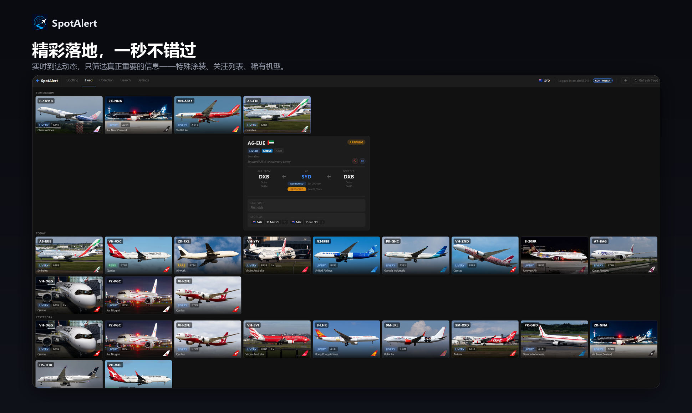
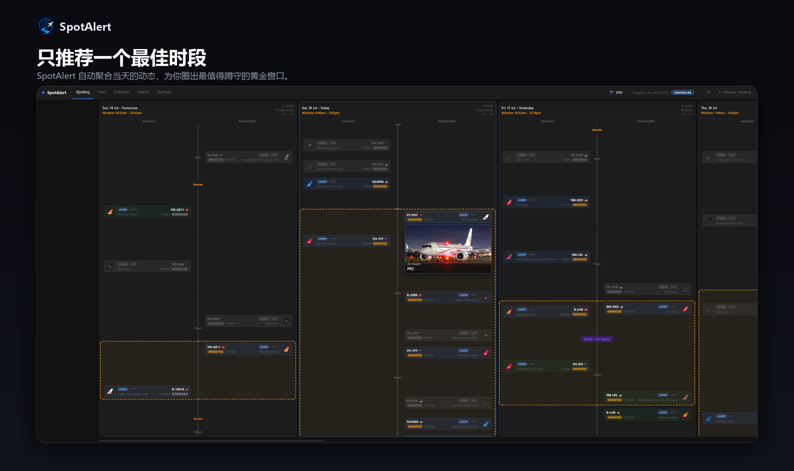
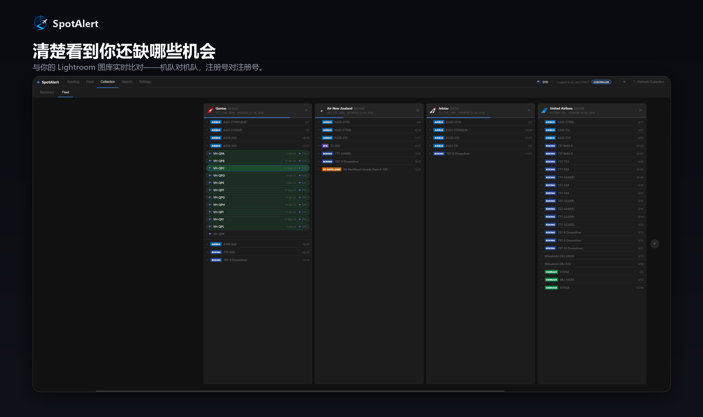
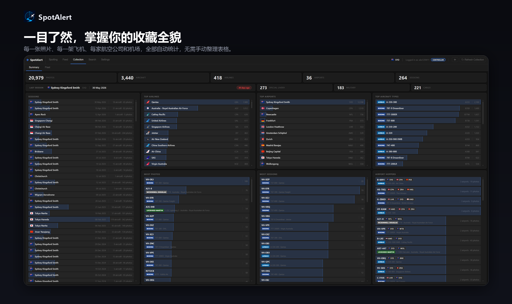
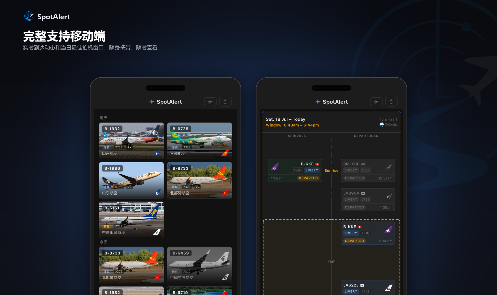

<p align="center">
  
</p>

<h1 align="center">SpotAlert</h1>

<p align="center"><a href="README.md">English</a> | <b>简体中文</b></p>

一款自托管的飞机拍摄助手。它在后台监控一个或多个机场的实时到达航班数据，一旦出现值得举起相机的目标——特殊涂装、您关注列表上的飞机、稀有的航空公司/机型组合，或是即将进近的军机——就会立刻通知您。这是一个多用户的渐进式网页应用（PWA），拍机小队中的每个人都可以拥有自己的账号、自己的筛选条件，以及直接推送到手机的通知，支持中英文双语。

<p align="center">
  
</p>
<p align="center">
  
</p>
<p align="center">
  
</p>
<p align="center">
  
</p>
<p align="center">
  
</p>

---

## 日常使用是什么样的

您（**Controller / 管理员**）选定一个机场，告诉 SpotAlert 您关心什么——特殊涂装航空公司名称中出现的关键词、您正在追的具体注册号或航空公司，或者简单地"某机型两周没出现就告诉我"。SpotAlert 会在后台持续轮询航班数据，一旦有匹配的飞机即将抵达：

- 立即在 **Feed（动态）** 页面生成一张卡片，附带飞机照片、航线、实时状态和预计起飞时间。
- 向每一个开启了推送的手机发送**推送通知**——使用该用户自己设置的语言。
- 被纳入当天的 **Spotting（拍机推荐）**——SpotAlert 会把当天有意思的到达航班聚合成一个最佳出发窗口，同时考虑光线质量和天气。

如果您用相机拍摄并维护 Lightroom 图库，SpotAlert 会（只读地）与之交叉比对，让 **Collection（收藏）** 和 **Fleet（机队）** 页面知道您*已经*拍过哪些飞机，而不仅仅是哪些飞机正在飞——您还可以直接在应用内点击预览任意历史拍摄场次的实际照片。

它天生支持多人协作：邀请 **Pilot（副驾驶）**（拥有自己的筛选条件和关注列表，仅限于您授权的机场）或 **Passenger（乘客）**（只读，跟随您的筛选条件）——每个人都有自己的账号、自己的推送通知、自己的语言设置。

---

## 功能

### 到达筛选器

每个筛选器独立触发——一趟航班可以同时匹配多个：

1. **特殊涂装（Special Livery）** — 根据航空公司名称中的可配置关键词匹配，并提取涂装描述（例如 "Air New Zealand (All Blacks Livery)" → "All Blacks Livery"）；当源数据本身提供双语信息时，会显示为原始中文文本
2. **注册号关注列表（Rego Watchlist）** — 您正在追的特定注册号
3. **机型关注列表（Type Watchlist）** — 特定的航空公司 + 机型组合
4. **航空公司/运营商关注列表（Airline/Operator Watchlist）** — 来自被关注航空公司或运营商的任何飞机
5. **稀有飞机（Rare Plane）** — 某航空公司 + 机型组合在缺席一段可配置天数后再次出现

### 网页应用（PWA）

可作为主屏幕应用安装在 iOS/Android 上，在您网络内的任何浏览器均可访问。完整中英文双语，按用户独立设置。

- **Feed（动态）** — 每次匹配都会生成按日期分组的卡片；包含航线、实时状态、起飞预测、飞机照片，以及（如果您之前拍过）该机尾的个人拍摄历史
- **Spotting（拍机推荐）** — 当天推荐的最佳拍机窗口，按活动间隔聚合，附带光线质量和天气信息
- **Collection（收藏）** — 将您的 Lightroom 图库与动态数据交叉比对；显示已拍摄、缺失的机型，以及按关键词的场次统计
- **Fleet（机队）** — 实时拉取完整航空公司机队数据；一目了然哪些机尾已拍到，未拍到的可直接加入关注列表
- **Search（搜索）** — 按注册号查询拍摄历史，按航班号查询航线机型，或浏览您的整个图库
- **场次照片预览** — 在 Collection、Feed、Fleet 或 Search 中点击任意历史场次，即可在应用内查看您实际拍摄的照片——仅限 Controller，对您的照片库只读访问（详见下文）
- **Settings（设置）** — 所有筛选条件、关注列表和监控配置，均可在界面内管理，并按角色分权限

### 多用户、多机场

- **角色**：Controller（完全控制权）、Pilot（在被授权的机场拥有自己的筛选条件/关注列表）、Passenger（只读，跟随 Controller 的筛选条件）
- 单次部署可同时**监控多个机场**——每个机场拥有独立的监控、独立的筛选条件、独立的数据
- **推送通知**（Web Push/VAPID —— 无需第三方服务，不使用 Telegram）独立分发给每个订阅用户，各自使用自己的语言，并根据各自的筛选条件和偏好重新校验

### 军机动态

- 通过 [adsb.fi](https://opendata.adsb.fi) 开放数据 API 监控附近的军用飞机——无需 API 密钥
- 在可配置的半径/高度范围内检测正在进近的飞机，并实时跟踪该次出现（GPS 轨迹点），直至其离开或降落停止
- 推送通知包含来源国（根据 ICAO 24 位十六进制地址推算）、注册号、呼号、机型和距离

### 场次照片预览

在应用内任意位置点击一个历史拍机场次，即可查看实际照片，叠加显示该航班的航空公司/机型/涂装信息——与 Feed 自身的照片卡片效果一致。直接读取您 RAW 文件中内嵌的预览图（无需额外导出步骤），且绝不会修改原始文件——挂载点在 Docker 层面即为只读，应用本身也从不写入。所需配置详见下文的[「Lightroom / 照片集成」](#lightroom--照片集成)。

### 拍机推荐

将当天有意思的到达航班聚合成一个最佳出发窗口，而非简单的时间列表。

- **活动聚类** — 事件间隔超过您设定的阈值即开启新窗口；取最大的聚类簇，再收缩到仍能覆盖簇内所有飞机的最紧凑区间
- **光线质量** — 标记日出/日落附近的低光/渐暗光线，以及正午刺眼强光时段
- **起飞配对** — 每个到达航班都会匹配其后续起飞航班（实时航班板 → 历史记录 → 学习到的过站规律），让您知道飞机实际会在地面停留多久
- **天气** — 显示在每天的窗口旁；同时用于可选的拍机提醒推送

### Lightroom 图库集成

读取您的 Adobe Lightroom 图库（只读，主应用绝不写入），用您自己的拍摄历史丰富 Feed/Collection/Fleet 页面。飞机元数据（注册号、航空公司、机型、机场）需要在 Lightroom 中通过 [AircraftMetadata Lightroom 插件](https://github.com/aviationphoto/AircraftMetadata-Lightroom-Plugin) 或 **SpotAlert Studio**（见下文）打标——两者写入图库时使用相同的插件 ID，因此 SpotAlert 无法区分数据来源。

### SpotAlert Studio（配套应用）

一个独立的、仅限本地运行的配套应用（`studio/`），用于整理您的 RAW 照片收件箱——对每个文件的注册号查询公开航班数据源（军机则回退到 JetPhotos），将文件归类到 `{日期} - {机场}/{航空公司}/{注册号}/` 文件夹结构中，并将解析出的元数据直接写入您的 Lightroom 图库。这是本项目中唯一会写入您图库的部分。它需要直接访问文件系统，因此在您自己的电脑上原生运行，不在 Docker 中运行。

```powershell
.\studio.ps1
```

配置说明见 [studio/README.md](studio/README.md)。

---

## 环境要求

- Docker + Docker Compose（推荐——本项目自身即以此方式部署和测试）
- 或者，如果不使用 Docker 直接运行两个进程，需要 Python 3.12+

---

## 快速开始（Docker Compose）

1. **克隆仓库**
   ```bash
   git clone https://github.com/abc539411/spotalert.git
   cd spotalert
   ```

2. **编辑 `docker-compose.yml`** — 卷挂载左侧的路径是*本项目自己*部署所用的宿主机路径（一台群晖 NAS）。请改成您希望各部分数据实际存放的宿主机位置：
   ```yaml
   volumes:
     - <你的路径>/data:/app/data
     - <你的路径>/lightroom:/app/lightroom
     - <你的路径>/logs:/app/logs
     - <你的路径>/translations:/app/static/translations
     - <你的路径>/airline_logos:/app/static/airline_logos
     - <你的路径>/session_thumbs:/app/static/session_thumbs
     # 可选 — 仅在需要场次照片预览功能时（见下文）：
     - "<你的照片文件夹>:/app/photos:ro"
   ```

3. **构建并启动**
   ```bash
   docker compose up -d --build
   ```

4. **查找管理员密码** — 全新安装会在首次启动时自动创建一个 Controller 账号：
   ```bash
   docker logs spotalert | grep "initial Controller"
   ```
   访问 `http://<你的主机>:7478`，使用用户名 `admin` 和该密码登录，然后在 Settings 页面修改密码。

5. **添加第一个机场** — Settings → Airports → Add Airport（输入 IATA 代码）。监控会立即开始。

6. **（可选）Lightroom 集成** — 在 Settings → Collection → My Catalog 上传您的 `.lrcat` 文件，或将 `LR_CATALOG_PATH` 指向 `lightroom/` 卷内已有的文件。

至此配置完成——应用已开始轮询到达航班，一旦您配置好筛选条件（Settings → 对应的筛选卡片），匹配结果就会开始显示。

### 不使用 Docker

直接运行两个进程：

```bash
pip install -r requirements.txt
python main.py              # 网页服务器，并会启动/监管监控进程
```

`main.py` 会自行启动 `monitor_service.py`——除非您想在完全没有网页界面的情况下单独运行监控循环，否则无需手动运行它；此时 `python monitor_service.py` 也可独立运行。

---

## Lightroom / 照片集成

两个相互独立的可选功能：

- **图库只读访问**（Collection/Fleet/Search-Catalogue 数据，"已拍摄"筛选门槛）：在 Settings 中按用户上传 `.lrcat`，或通过 `lightroom/` 卷挂载。
- **场次照片预览**（点击场次查看实际照片）：需要将您的 RAW 照片文件夹以只读方式挂载进容器（见上文快速开始中的可选卷挂载行），并在 Settings → Collection → Session Photos Path 中告知容器内对应的路径（默认为 `/app/photos`——仅当您挂载到其他路径时才需要修改）。需要镜像中包含 `exiftool`，已包含在提供的 `Dockerfile` 中。仅限 Controller 使用。

---

## 配置

登录后，几乎所有配置都通过 **Settings** 页面管理，而非环境变量或配置文件。以下是一些较重要的设置项：

| 设置项 | 说明 | 默认值 |
|---|---|---|
| `CHECK_INTERVAL_MINUTES` | 轮询到达航班的频率 | 30 |
| `FETCH_PAGES` | 每次检查抓取的页数（约每页 100 个航班） | 2 |
| `SPECIAL_LIVERY_KEYWORDS` | 用于匹配航空公司名称的逗号分隔关键词 | `Livery,livery,Sticker,sticker` |
| `RARE_PLANE_MIN_ABSENCE_DAYS` | 组合需缺席多少天才被视为稀有 | 7 |
| `DEPARTURE_PATTERN_THRESHOLD` | 显示预测起飞时间所需的最低置信度百分比；0 = 关闭 | 80 |
| `MILITARY_CHECK_INTERVAL_MINUTES` | 检查军机动态的频率 | 15 |
| `MILITARY_RADIUS_NM` | 机场周围的搜索半径（海里，最大 250） | 50 |
| `MILITARY_MAX_ALT_FT` | 判定军机为"进近中"的最高高度 | 5000 |
| `LOGOSTREAM_API_KEY` | 用于获取航司尾翼 logo 的 API 密钥（Logostream）——可选；未配置时航司 logo 将不会显示（军机国籍徽章不受影响，来源独立） | — |
| `SESSION_PHOTOS_PATH` | 照片文件夹在容器内的挂载路径（见上文） | `/app/photos` |

网页服务器自身的端口仍由一个环境变量控制：`WEB_PORT`（容器内默认为 `8088`——按照上方 Docker Compose 示例，映射到您想要的宿主机端口）。

---

## 数据持久化

- **`data/control.db`** — 账号、角色、机场访问权限、推送订阅
- **`data/spotalert.db`** + **`data/airports/{IATA}.db`** — 每个被监控机场各一个 SQLite 文件：航班历史、筛选条件/关注列表、设置、参考数据缓存
- **`logs/`** — 网页进程和监控进程各自的滚动日志文件
- **`static/translations/`** — 缓存的中文翻译（避免每次都重新调用翻译 API）
- **`static/airline_logos/`** — 缓存的航空公司 logo / 军机国籍徽章
- **`static/session_thumbs/`** — 场次照片预览功能生成的缩略图

每日备份保存至 `data/backups/`，保留最近 7 份。

---

## 许可证

本项目基于 [MIT 许可证](LICENSE) 发布。

### 第三方代码与数据

**FlightRadarAPI** — `flightradar24api/` 模块是 [JeanExtreme002](https://github.com/JeanExtreme002) 的 [FlightRadarAPI](https://github.com/JeanExtreme002/FlightRadarAPI/tree/main/python) Python 库的修改版本，基于 MIT 许可证发布。

**FlightRadar24 数据** — 本项目访问 FlightRadar24 的非官方 API。FlightRadar24 的[服务条款](https://www.flightradar24.com/terms-and-conditions)限制其数据**仅供个人非商业用途使用**。请勿在未从 FlightRadar24 获得正式数据授权的情况下将本项目用于任何商业场景。

**adsb.fi 开放数据** — 军机数据来源于 [opendata.adsb.fi](https://opendata.adsb.fi)。该数据**仅供个人非商业用途使用**，完整使用条款见 [adsb.fi](https://adsb.fi)。

**AircraftMetadata Lightroom 插件** — 从 Lightroom 图库读取的飞机元数据字段（注册号、航空公司、机型、机场）可由 [aviationphoto](https://github.com/aviationphoto) 的 [AircraftMetadata Lightroom 插件](https://github.com/aviationphoto/AircraftMetadata-Lightroom-Plugin) 创建，也可由 SpotAlert Studio（本仓库 `studio/`）创建。

**Logostream** — 航空公司尾翼 logo 通过 [Logostream](https://airline.logostream.dev/) API（免费额度）获取，在此感谢 Logostream 提供的 logo 数据——SpotAlert 仅在您自行配置 `LOGOSTREAM_API_KEY` 时才会调用该 API。
